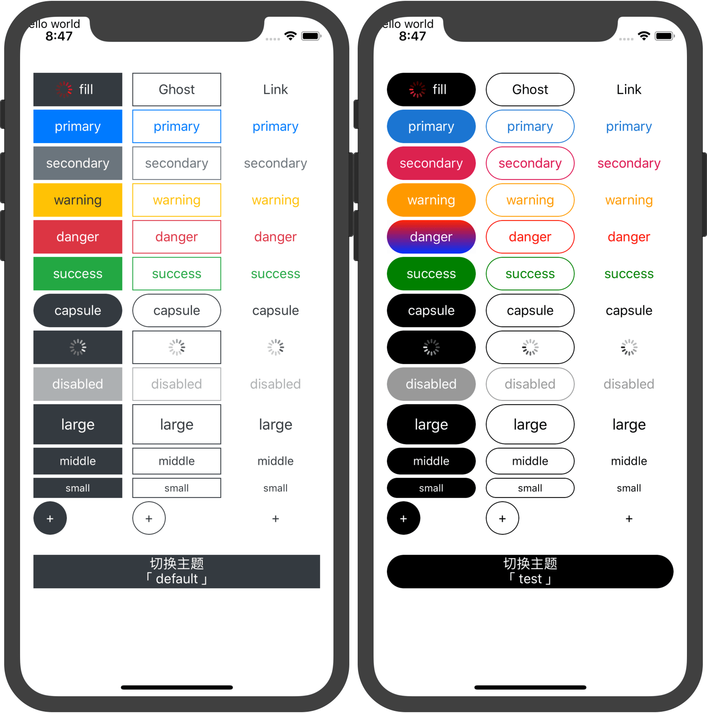

# nu-react-native-button

[](https://www.npmjs.org/package/@_nu/react-native-button)
[](https://github.com/nu-system/react-native-button)

这是 NU 「 no-ui 」 组件库系统 nu-system，按钮组件 React native 实现。



## 怎么用？

```bash
npm i @_nu/react-native-button
```

## 二次封装

选择 `NuButton` 意味着你选择的是一整套按钮解决方案。

因为不同的项目有不同的皮肤，在实际项目中使用需要二次封装。

这里默认采用的是 bootstrap 皮肤。

```JSX
import React from 'react';
import NuButton, {createNuButtonTheme} from '@_nu/react-native-button';

/**
 * 创建默认按钮主题
 */
createNuButtonTheme({
  levelColors: {
      default: '#343a40',
      secondary: '#6c757d',
      primary: '#007bff',
      warning: '#ffc107',
      danger: '#dc3545',
      success: '#22A745',
  }
});

/**
 * 创建 test 按钮主题
 */
createNuButtonTheme({
    name:'test',
    levelColors: {
        default: '#000000',
        primary: '#1976d2',
        secondary: 'rgb(220, 0, 78)',
        warning: '#ff9900',
        danger: 'red',
        success: 'green',
    }
});

export default NuButton;
```

## 使用

```JSX
import Button from "./components/Button";

const Page=()=>{    
    return (
     <div>
        <Button variant="ghost" size="large">一个大的幽灵按钮</Button>                
        <Button theme="test" variant="ghost" size="large">一个大的幽灵主按钮</Button>
     </div>     
    );
};
```

## Api

### NuButton

| props   | 类型 | 默认值 | 功能 |
|:-----|:-----:|:-----:|:-----:|
| theme |  'string' | 'default' | 按钮主题 |
| disabled |  boolean | - | 不可用按钮 |
| loading |  boolean | - | loading按钮 |
| capsule |  boolean | - | 圆角按钮|
| circle |  boolean | - | 正圆按钮 |
| level | 'default', 'primary', 'secondary', 'warning', 'danger', 'success' | `default` | 按钮等级 |
| variant | 'fill', 'ghost', 'link' | `fill` | 按钮变体 |
| size | \['large', 'default', 'middle', 'small' \] or `number` | `default` | 按钮大小 |

*注*: 虽然提供了 `size` 可以为 `number` 的接口，但是这个是非常不推荐使用的。你使用这种方式，意味着你定义的这个按钮样式是没法被人复用的。

### createNuButtonTheme 

| 参数   | 类型 | 默认值 | 功能 |
|:-----|:-----:|:-----:|:-----:|
| `name` |  `string` | `default` | 主题名称 |
| `defaultProps` |  `Object`| 见下面 | 默认属性 |
| `levelColors` |  `object` | 见下面 | 按钮主色列表 |
| `Wrap` |  `func node` | 见下面 | 按钮容器对象 |
| `WrapAndroid` |  `func node` | 见下面 | 安卓按钮容器对象 |
| `Content` |  `func node` | 见下面 | 内容器 |
| `Txt` |  `func node` | 见下面 | 文本容器 |
| `Loader` |  `func node` | 见下面 | 加载对象 |
| `wrapStyle` |  `object` | 见下面 | 主容器样式 |
| `contentStyle` |  `object` | 见下面 | 内容器样式 |
| `textStyle` |  `object` | 见下面 | 文本容器样式 |

### `defaultProps`

```JSX
defaultProps: {
    level: 'default',
    variant: 'fill'
}
```

这是默认会添加到按钮上的属性值。

### `Wrap, Content, Txt, Loader`

这四个对象拥有相同的API和使用方法，必须返回一个 `node` 对象。

```JSX
{
    WrapAndroid: function ({children, level, variant, ...otherProps}) {
        return <TouchableNativeFeedback
            background={TouchableNativeFeedback.SelectableBackground()} {...otherProps}>{children}</TouchableNativeFeedback>;
    },
    Wrap: function ({children, level, variant, ...otherProps}) {
        return <TouchableOpacity activeOpacity={0.5} {...otherProps}>{children}</TouchableOpacity>;
    },
    Txt: Text,
    Content: View,
    Loader: function ({level, variant, wrapStyle, contentStyle, textStyle}) {
        return (<ActivityIndicator animating={true} color={textStyle.color}/>);
    }
}
```

- level: 当下按钮的等级
- variant: 当下按钮的变体
- wrapStyle: 计算之后的主容器样式
- contentStyle: 计算之后的内容器样式
- textStyle:  计算之后的文本样式

#### 组件结构

```JSX
<Wrap>
    <Content>
        <Txt>Button</Txt>
    </Content>
</Wrap>
```

当 loading 的时候

```JSX
<Wrap>
    <Content>
        <Loader />
    </Content>
</Wrap>
```

### Api `wrapStyle` ,`contentStyle`, `textStyle`

这三个对象拥有相同的API和使用方法。

```JSX
{
    wrapStyle: {
        default: {
            position: 'relative',
            overflow: 'hidden',
            height: 40,
        },
        capsule: {
            borderRadius: 100
        },
        circle: {
            borderRadius: 100
        },
        large: {
            height: 48
        },
        middle: {
            height: 32
        },
        small: {
            height: 24
        },
        ghost: {
            borderWidth: 1
        },
        disabled: {
            opacity: 0.4
        }
    },
    textStyle: {
        default: {
            color: "#ffffff",
            fontSize: 16,
            textAlign: 'center',
            marginLeft: 8,
            marginRight: 8
        },
        large: {
            fontSize: 18
        },
        middle: {
            fontSize: 14
        },
        small: {
            fontSize: 12
        },
        customStyle: function ({warning, fill, style}) {
            if (warning && fill) {
                style.color = '#333333';
            }
            return style;
        }
    },
    contentStyle: {
        default: {
            width: '100%',
            height: '100%',
            alignItems: 'center',
            justifyContent: 'center',
            flexDirection: 'row'
        }
    }
}
```

除了 `default` 之外的所有 bool 属性，都会在实际渲染的时候和 `default` 样式合并然后经过 `customStyle` 再渲染。


#### customStyle

必须要返回 style 对象。

- level: 当下按钮的等级
- variant: 当下按钮的变体
- style: 当下计算好的样式


你甚至可以自定义任何 bool 属性。

```JSX
{
    wrapStyle:{
        h100:{
            height: 100
        }
    }
}
```

```JSX
<Button h100>高100的按钮</Button>
```

### `levelColors`

```JS
const levelColors= {
    default: '#343a40',
    primary: '#007bff',
    secondary: '#6c757d',
    warning: '#ffc107',
    danger: '#dc3545',
    success: '#22A745',
};
```

## FAQ

### 添加图标

```JSX
<Button before={<ActivityIndicator animating={true} color={'red'}/>}>图标在我左边</Button>
<Button after={<ActivityIndicator animating={true} color={'red'}/>}>图标在我右边</Button>
```

### 多行文本

```JSX
<Button>{({textStyle}) => {
    return (
        <View>
            <Text style={textStyle}>切换主题</Text>
            <Text style={textStyle}>「default</Text>
        </View>
    );
}}</Button>
```


### 渐变背景

```JSX
{    
    name:'test',
    Content: function ({children, style, level, variant}) {
        /* 修改 fill danger 按钮为渐变背景  */
        if (level === 'danger' && variant === 'fill') {
            return (
                <LinearGradient
                    colors={["red", "blue"]}
                    style={style}
                >{children}</LinearGradient>
            );
        } else {
            return (
                <View style={style}>{children}</View>
            );
        }
    },
}
```

